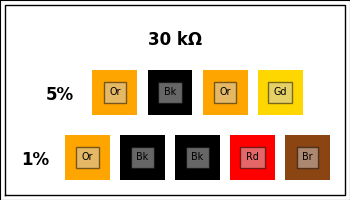
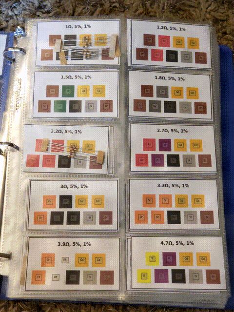

# Resistor Code Bizcards for Resistor Organization

Create business-card-sized images of resistor values and color codes for use in [business card binder
sleeves](https://www.amazon.com/business-card-binder-sleeves/s?k=business+card+binder+sleeves).

Example:

<figure>

<figcaption>This example card shows the color code for a four-band 5% tolerance resistor and a five-band 1% tolerance resistor</figcaption>
</figure>

Example pages:

<figure>

<figcaption>Business card binder pages with resistors.</figcaption>
</figure>

I have it currently set up with one page (front and back) per multiplier, but I might switch to one
page per value since I have tons of 1, 10, 100, etc.

## Code Usage

### Requirements

- Python 3.10 (mostly for syntax reasons--could be rewritten for earlier Python)
- matplotlib
- Pillow

I probably could have done all the image generation with Pillow, but matplotlib was what I reached for first.

### Running the code

In a Python environment with all of the required dependencies installed, run

`python resistor_cards.py`

...to generate a directory `pngs` with individual business-card sized images and 2x5 pages of business cards
for printing. The E-12 series plus the values `3.0` and `5.1` are printed with exponents from `-1` through
`6`, thus printing values from 0.1 Ω to 8.2 MΩ.

### Customization

- `resistor.py` has all the code for converting between resistor color codes and values, mostly in the
  `Resistor` class. You shouldn't need to change this.
- `resistor_cards.py` has all the code for generating the business card images and putting them into sheets
  for efficient printing. To change the values or exponents of the generated cards, modify the very bottom of
  the file in the section, which is what is run when the file is executed as a script, as above.

  ```python
  if __name__ == "__main__":
      ...
  ```

  To further modify how the cards and pages are generated, modify these functions:

  - `generate_card()`
  - `generate_cards()`
  - `gen_print_page()`
  - `gen_print_pages()`
